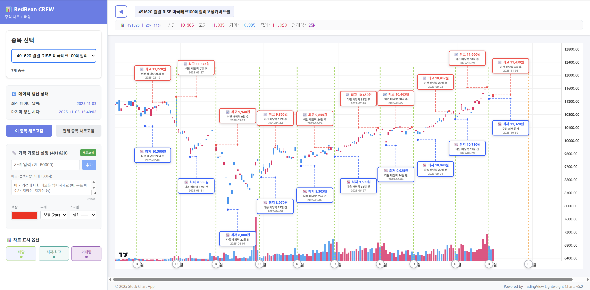

# 현재의 기술 스택, 기능 및 데이터 구조

## 클라이언트
### 기술 스택
1. react

### 기능

1. 백엔드의 데이터로 차트, 종목 이름, 거래량 시각화
2. 가로선 저장
3. 배당락 버튼 및 세로선
4. 배당일의 구간마다 최저, 최고가 언제인지 표시
5. 사이드바 토글
6. 차트의 요소들 끄고 켤 수 있는 기능
   1. 배당
   2. 최저/최고
   3. 거래량

## 서버
### 기술 스택
1. Spring Boot
2. Fastapi
3. mariadb

### 기능
1. 한국투자증권 서버에서 매일 15:40 마다 현재 데이터 종목들의 데이터 가져오기
2. 클라이언트 요청 데이터 내보내기

### 데이터
| stockdata | | | | | | | | | | |
|---|---|---|---|---|---|---|---|---|---|---|
|data_time| code | time | | | | | | | | 마지막 데이터 갱신 시간 |
|dividend | code | date | price | | | | | | | 배당금, 배당락일 |
|horizontal|id|color|create_at|line_style|line_width|memo|price|stockcode|updated_at|가로선 생성 데이터|
|stock|code|date|open|high|low|close|volume| | | 주식 데이터 시고저종거|
|stock_info|code|name|period| | | | | | | 전체 이름, 월중/월말 |